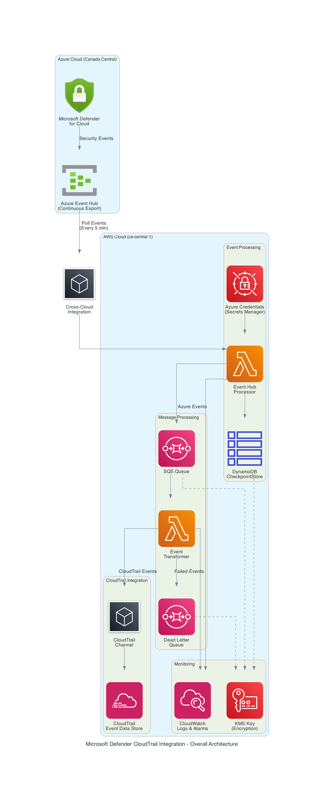

# Microsoft Defender for Cloud - CloudTrail Integration

A complete cross-cloud security integration solution that connects Microsoft Defender for Cloud with AWS CloudTrail Event Data Store for unified security monitoring and compliance reporting.

## Architecture Overview

This solution creates a reliable, scalable integration between Azure and AWS clouds, enabling organizations to centralize Microsoft Defender security events in AWS CloudTrail for unified analysis alongside existing AWS security data.

### Key Components

- **Azure Infrastructure**: Event Hub for receiving Microsoft Defender continuous export data
- **AWS Infrastructure**: Lambda functions, SQS queues, and CloudTrail Event Data Store for processing and storage
- **Cross-Cloud Integration**: Secure credential management via AWS Secrets Manager
- **Monitoring**: Comprehensive CloudWatch and Azure Monitor for operational visibility

## Solution Architecture

The integration follows a multi-stage processing pipeline with optional VNet Flow Logs support:

```
Microsoft Defender for Cloud → Azure Event Hub → AWS Event Hub Processor Lambda →
DynamoDB CheckpointStore → SQS Queue → AWS Event Transformer Lambda →
CloudTrail Channel → CloudTrail Event Data Store

Optional Flow:
VNet Flow Logs → Storage Account → Event Grid (Cloud Event Schema v1.0) →
Azure Event Hub → AWS Lambda → CloudTrail Event Data Store
```

### Data Flow Process

**Microsoft Defender Flow:**
1. **Microsoft Defender Continuous Export**: Security events sent to Azure Event Hub
2. **Scheduled Processing**: AWS Lambda polls Azure Event Hub every 5 minutes
3. **Checkpoint Management**: DynamoDB maintains processing state for reliable resumption
4. **Message Queuing**: Events forwarded to SQS for decoupled processing
5. **Event Transformation**: Azure events converted to CloudTrail-compatible format
6. **CloudTrail Integration**: Events delivered to CloudTrail Event Data Store via Channel
7. **Unified Storage**: Events available for analysis alongside native AWS security data

**VNet Flow Logs Flow (Optional):**
1. **VNet Flow Logs**: Network traffic logs written to dedicated storage account
2. **Event Grid Monitoring**: Blob creation events captured via Event Grid subscription
3. **Cloud Event Schema**: Events formatted using Cloud Event Schema v1.0
4. **EventHub Forwarding**: Events routed to same EventHub for unified processing
5. **Secure Access**: Azure App Registration provides AWS Lambda read access to storage
6. **Unified Processing**: Flow log events processed through same transformation pipeline

## Deployment Components

### Azure Infrastructure (Terraform)

Located in [`terraform/`](terraform/) directory:

- **Event Hub Namespace**: Auto-scaling namespace with Standard SKU
- **Event Hub**: 4-partition Event Hub with 1-day retention for stream-through processing
- **VNet Flow Logs Integration**: Optional network traffic flow logging with Event Grid triggers
- **Storage Account**: Dedicated storage for VNet flow log data
- **Event Grid Subscription**: Real-time blob creation monitoring with Cloud Event Schema v1.0
- **Azure App Registration**: Secure authentication for AWS Lambda access to flow logs
- **Resource Group**: Organized Azure resource management
- **Monitoring**: Log Analytics workspace with email/webhook alerting
- **RBAC**: Least-privilege access controls for Microsoft Defender and flow logs

**Documentation**: [`terraform/README.md`](terraform/README.md)

### AWS Infrastructure (CDK)

Located in [`cdk/`](cdk/) directory:

- **Event Hub Processor Lambda**: Scheduled Azure Event Hub polling function
- **Event Transformer Lambda**: SQS-triggered CloudTrail format conversion
- **DynamoDB CheckpointStore**: Reliable event processing state management
- **SQS Queue with DLQ**: Reliable message processing with retry handling
- **CloudTrail Event Data Store**: Unified security event storage
- **CloudTrail Channel**: External event ingestion pathway
- **Secrets Manager**: Secure Azure credential storage
  - Azure EventHub credentials for Defender data
  - Azure Flow Logs credentials for network traffic data
- **CloudWatch Monitoring**: Comprehensive logging and alerting

**Documentation**: [`cdk/README.md`](cdk/README.md)

### Configuration Scripts

Located in [`scripts/`](scripts/) directory:

- **Automated Configuration**: Scripts for cross-cloud credential synchronization
  - EventHub credentials configuration
  - Flow Logs credentials configuration (when enabled)
- **Setup Automation**: Streamlined deployment workflow scripts

**Documentation**: [`scripts/README.md`](scripts/README.md)

## Architecture Diagrams

Visual architecture diagrams are available in the [`diagrams/`](diagrams/) directory:



**Available Diagrams**:
- [`01_overall_architecture.png`](diagrams/01_overall_architecture.png) - Complete cross-cloud architecture
- [`02_data_flow.png`](diagrams/02_data_flow.png) - Detailed data processing flow
- [`03_aws_components.png`](diagrams/03_aws_components.png) - AWS infrastructure components
- [`04_azure_components.png`](diagrams/04_azure_components.png) - Azure infrastructure components
- [`05_integration_flow.png`](diagrams/05_integration_flow.png) - Step-by-step integration process

**Diagram Documentation**: See [`diagrams/README.md`](diagrams/README.md) for detailed descriptions and usage guidance.

**Regenerating Diagrams**:
```bash
pip install diagrams
python architecture_diagrams.py
```

## Deployment Guide

### Prerequisites

**Azure Requirements**:
- Azure subscription with appropriate permissions
- Terraform >= 1.0
- Azure CLI >= 2.30

**AWS Requirements**:
- AWS account with deployment permissions
- AWS CDK 2.x
- Node.js 18+
- Python 3.11+

### Deployment Sequence

#### 1. Deploy Azure Infrastructure First

```bash
cd terraform
terraform init
terraform apply -var-file="terraform.tfvars"
```

#### 2. Deploy AWS Infrastructure

```bash
cd ../cdk
npm install
cdk bootstrap  # First time only
cdk deploy
```

#### 3. Configure Cross-Cloud Integration

```bash
cd ../scripts
./configure-secrets-manager.sh
```

#### 4. Configure Microsoft Defender Export

1. Navigate to Microsoft Defender for Cloud in Azure portal
2. Go to Environment Settings > Continuous Export
3. Enable Export as trusted service
4. Configure export to your deployed Azure Event Hub
5. Select data types: Security alerts, Recommendations, Secure score
6. Navigate to the event hub, select Access Control IAM
7. + Add a Role assignment
8. `Azure Event Hubs Data Sender`
9. Service Principal `Windows Azure Security Resource Provider`

#### 5. Configure VNet Flow Logs (Optional)

If you enabled VNet Flow Logs during Terraform deployment:

```bash
# Verify flow logs configuration
terraform output vnet_flow_logs_summary

# Verify Event Grid subscription
terraform output eventgrid_subscription

# Get Flow Logs credentials
terraform output -json flowlog_ingestion_app_registration
```

The configuration script automatically populates both EventHub and Flow Logs credentials:

```bash
cd scripts
./configure-secrets-manager.sh
```

This configures:
- Azure EventHub credentials for Defender data
- Azure Flow Logs credentials for network traffic data (if enabled)

## Key Features

### Enterprise Security
- **Cross-Cloud Authentication**: Secure credential management with AWS Secrets Manager
- **Encryption**: Customer-managed KMS keys for all data at rest
- **Network Security**: TLS 1.2+ for all communications
- **Access Controls**: IAM least-privilege principles throughout
- **Azure App Registration**: Dedicated service principal for secure flow logs access

### High Performance
- **Scheduled Processing**: Configurable polling intervals (default: 5 minutes)
- **Checkpoint Management**: Reliable event resumption after failures
- **Batch Processing**: Efficient SQS batch processing with configurable sizes
- **Parallel Processing**: Configurable Lambda concurrency for throughput
- **Event Grid Integration**: Real-time event processing with Cloud Event Schema v1.0

### Comprehensive Monitoring
- **CloudWatch Integration**: Detailed logging and metrics for all components
- **Proactive Alerting**: SNS notifications for errors and performance issues
- **Dead Letter Queue**: Failed event capture and analysis
- **Operational Metrics**: Processing rates, success rates, and latency tracking
- **Azure Monitor**: Optional integration for flow logs monitoring

### Network Traffic Visibility (Optional VNet Flow Logs)
- **VNet Flow Logs**: Comprehensive network traffic logging and analysis
- **Event Grid Triggers**: Real-time blob creation monitoring
- **Cloud Event Schema**: Modern event format (v1.0) for standardization
- **Storage Account Integration**: Dedicated storage with configurable retention
- **Automated Authentication**: Secure cross-cloud access via App Registration

### Security Lake and CloudTrail Integration
- **CloudTrail Compatibility**: Events stored in native CloudTrail format for Athena-based analytics
- **Security Lake OCSF Support**: Optional transformation to OCSF v1.7.0 for AWS Security Lake integration
- **ASFF Format Support**: AWS Security Hub integration with Security Finding Format v2018-10-08
- **Unified Analysis**: Integration with existing AWS security analytics and SIEM solutions
- **Standard Tooling**: Compatible with existing AWS security tools and workflows
- **Compliance Ready**: Audit trails and retention policies for compliance frameworks
- **Multi-Source Data**: Combine Defender alerts with network flow data

## Configuration Management

### Core Configuration Files

- **[`cdk/config.yaml`](cdk/config.yaml)**: Main CDK configuration
- **[`cdk/config.example.yaml`](cdk/config.example.yaml)**: Template with inline documentation
- **[`terraform/terraform.tfvars.example`](terraform/terraform.tfvars.example)**: Terraform configuration template

### Configuration Documentation

- **[`cdk/CONFIGURATION.md`](cdk/CONFIGURATION.md)**: Complete configuration reference guide
- Environment-specific examples and best practices included
- Security and performance tuning guidance provided

## Operational Procedures

### Monitoring and Troubleshooting

**CloudWatch Logs**:
```bash
# Monitor Event Hub Processor
aws logs tail "/aws/lambda/mdc-event-hub-processor-dev" --follow

# Monitor Event Transformer
aws logs tail "/aws/lambda/mdc-event-transformer-dev" --follow
```

**Queue Monitoring**:
```bash
# Check main queue status
aws sqs get-queue-attributes --queue-url <QUEUE_URL> --attribute-names All

# Check dead letter queue
aws sqs receive-message --queue-url <DLQ_URL>
```

**CloudTrail Event Data Store**:
```bash
# Query recent events
aws cloudtrail start-query \
  --query-statement "SELECT * FROM <EVENT_DATA_STORE_ID> WHERE eventSource = 'microsoft-defender-for-cloud' ORDER BY eventTime DESC LIMIT 10"
```

### Performance Tuning

**Development Environment**:
- Memory: 512MB Lambda memory sufficient for typical loads
- Polling: 5-minute intervals balance cost and latency
- Retention: 90-day CloudTrail retention for cost optimization

**Production Environment**:
- Memory: Scale to 1024MB for high-volume processing
- Concurrency: Increase transformer concurrency based on throughput needs
- Retention: 7-year retention for compliance requirements
- Encryption: Customer-managed KMS keys for enhanced security

## Integration Testing

### End-to-End Validation

1. **Generate Test Data**: Create security alerts in Microsoft Defender
2. **Monitor Processing**: Watch Lambda execution logs
3. **Verify Queuing**: Check SQS message flow
4. **Validate Transformation**: Confirm CloudTrail format compliance
5. **Check Storage**: Verify events in CloudTrail Event Data Store

### Common Integration Issues

| Issue | Cause | Solution |
|-------|-------|----------|
| Azure Connection Failed | Invalid Event Hub credentials | Verify Secrets Manager configuration |
| No Events Received | Microsoft Defender export not configured | Configure continuous export in Azure portal |
| CloudTrail Channel Error | Missing permissions | Verify Lambda IAM role permissions |
| High Processing Latency | Insufficient concurrency | Increase Lambda reserved concurrency |

## Security Considerations

### Data Protection
- **Encryption in Transit**: TLS 1.2+ for all cross-cloud communications
- **Encryption at Rest**: KMS encryption for all AWS storage components
- **Credential Security**: Azure connection strings stored in AWS Secrets Manager
- **Access Logging**: Complete audit trail for all data access

### Network Security
- **Azure Network Rules**: Configurable IP and VNet restrictions
- **AWS VPC Integration**: Optional VPC endpoints for private connectivity
- **TLS Enforcement**: Minimum TLS 1.2 for Azure Event Hub connections

### Compliance Features
- **Audit Trails**: Complete logging of all data processing activities
- **Retention Policies**: Configurable data retention for compliance requirements
- **Data Classification**: Maintains security classifications through processing pipeline
- **Change Tracking**: CloudFormation and Terraform state management

## Cost Optimization

### Development Costs
- **Lambda**: Pay-per-execution (5-minute intervals)
- **DynamoDB**: On-demand billing for checkpoint storage
- **SQS**: Pay-per-message processing
- **CloudTrail**: Pay per GB ingested and stored
- **Estimated**: $10-50/month for typical development workloads

### Production Optimization
- **Reserved Concurrency**: Control Lambda costs and performance
- **Provisioned Capacity**: DynamoDB provisioned capacity for predictable workloads
- **Log Retention**: Configure appropriate CloudWatch log retention periods
- **Data Lifecycle**: Implement Event Data Store retention policies

## Support and Documentation

### Component Documentation
- **[CDK Infrastructure](cdk/README.md)**: AWS infrastructure deployment and configuration
- **[Terraform Infrastructure](terraform/README.md)**: Azure infrastructure deployment
- **[Configuration Guide](cdk/CONFIGURATION.md)**: Complete configuration reference
- **[Deployment Guide](cdk/DEPLOYMENT_GUIDE.md)**: Step-by-step deployment instructions
- **[Configuration Scripts](scripts/README.md)**: Automated setup and configuration tools

### Lambda Function Documentation
- **[Event Hub Processor](../../security-lake/cdk/modules/azure/src/lambda/event-hub-processor/README.md)**: Azure Event Hub polling function with checkpoint store (see also: [Azure Module README](../../security-lake/cdk/modules/azure/README.md))
- **[Event Transformer](../../security-lake/cdk/src/lambda/event-transformer/README.md)**: Multi-format transformation (CloudTrail, OCSF, ASFF)
  - [Event Transformer CHANGELOG](../../security-lake/cdk/src/lambda/event-transformer/CHANGELOG.md) - Recent updates and bug fixes
  - [Debugging Failed Events](../../security-lake/cdk/src/lambda/event-transformer/DEBUGGING_FAILED_EVENTS.md) - Troubleshooting transformation issues
  - [DLQ Processing Guide](../../security-lake/cdk/src/lambda/event-transformer/dlq_processing_guide.md) - Dead Letter Queue management
- **[Flow Log Processor](../../security-lake/cdk/src/lambda/flow-log-processor/README.md)**: Azure VNet Flow Logs processing with OCSF transformation and Security Lake integration

### Troubleshooting Documentation
- **[Checkpoint Troubleshooting](cdk/CHECKPOINT_TROUBLESHOOTING.md)**: Azure EventHub checkpoint store issues
- **[Debugging Failed Events](cdk/src/lambda/event-transformer/DEBUGGING_FAILED_EVENTS.md)**: Event transformation debugging
- **[DLQ Processing Guide](cdk/src/lambda/event-transformer/dlq_processing_guide.md)**: Dead Letter Queue management
- **[General Troubleshooting](cdk/src/lambda/event-transformer/TROUBLESHOOTING.md)**: Common Lambda issues and solutions

### Additional Resources

**Related Project Documentation:**
- **[Security Lake Integration Framework](../../security-lake/cdk/README.md)**: Core framework overview
- **[Installation Guide](../../security-lake/INSTALLATION_GUIDE.md)**: Complete installation walkthrough
- **[Configuration Schema](../../security-lake/docs/CONFIG_SCHEMA.md)**: Detailed configuration options
- **[Module Development Guide](../../security-lake/docs/MODULE_DEVELOPMENT_GUIDE.md)**: Creating new integrations

**External Resources:**
- **[AWS CDK Documentation](https://docs.aws.amazon.com/cdk/)**: Official CDK guidance
- **[CloudTrail Lake Documentation](https://docs.aws.amazon.com/awscloudtrail/latest/userguide/cloudtrail-lake.html)**: CloudTrail Event Data Store documentation
- **[AWS Security Lake Documentation](https://docs.aws.amazon.com/security-lake/)**: Security Lake and OCSF
- **[Terraform Azure Provider](https://registry.terraform.io/providers/hashicorp/azurerm/latest/docs)**: Azure resource management
- **[Microsoft Defender Documentation](https://docs.microsoft.com/en-us/azure/defender-for-cloud/)**: Microsoft Defender for Cloud configuration

## Version Information
- **Solution Version**: 1.0.0
- **Architecture**: CloudTrail Event Data Store with Channel integration
- **Python Runtime**: 3.13 (ARM64)
- **CDK Version**: 2.95.1+
- **Terraform Version**: >= 1.0
- **OCSF Schema Version**: 1.7.0
- **ASFF Schema Version**: 2018-10-08

## Quick Start

```bash
# 1. Deploy Azure infrastructure
cd terraform && terraform apply -var-file="terraform.tfvars"

# 2. Deploy AWS infrastructure
cd ../cdk && npm install && cdk deploy -c configFile=config.yaml

# 3. Configure cross-cloud integration
cd ../scripts && ./configure-secrets-manager.sh

# 4. Configure Microsoft Defender export (see step 4 above)

# 5. Verify deployment
aws logs tail "/aws/lambda/mdc-event-hub-processor-dev" --follow
```

This solution provides enterprise-grade cross-cloud security integration with comprehensive monitoring, reliable processing, and unified event storage for enhanced security visibility across multi-cloud environments.