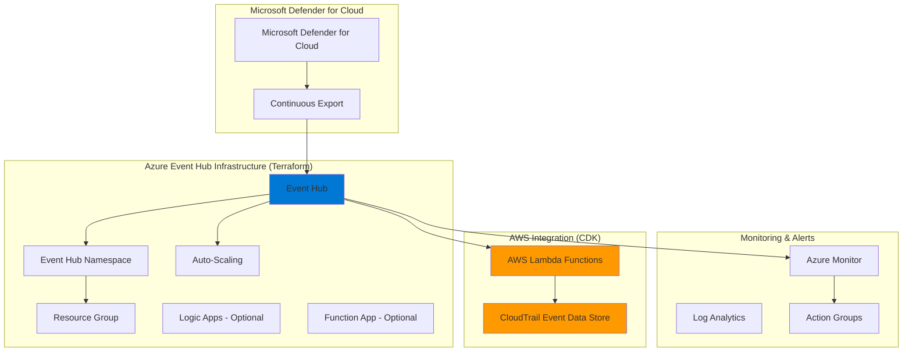

# Microsoft Defender for Cloud - Azure Event Hub Integration

A comprehensive Terraform solution for creating Azure Event Hub infrastructure to receive continuous export data from Microsoft Defender for Cloud, designed to integrate with AWS CloudTrail processing via the companion CDK stack.

[](https://www.terraform.io/)
[](https://azure.microsoft.com/)

## Architecture Overview

This solution creates a lean, efficient Azure Event Hub infrastructure that receives continuous export data from Microsoft Defender for Cloud and makes it available for consumption by AWS Lambda functions deployed via the companion CDK stack.



## Features

### Enterprise-Ready Infrastructure
- **Auto-scaling Event Hub Namespace** with configurable throughput units
- **Multi-region deployment support** for high availability
- **Network access controls** and security configurations
- **Least privilege IAM/RBAC** with dedicated service principals

### Fully Configurable
- **Comprehensive variables** with validation and documentation
- **Multiple deployment scenarios** (dev, staging, production)
- **Flexible monitoring and alerting** configuration
- **Optional Key Vault integration** for secret management

### Observability & Monitoring
- **Azure Monitor integration** with custom metric alerts
- **Log Analytics workspace** with configurable retention
- **Diagnostic logging** for Event Hub operations
- **Multi-channel alerting** (email, webhooks, etc.)

### Security-First Design
- **TLS 1.2+ enforcement** for all communications
- **Network isolation** support with IP and VNet rules
- **Managed identities** for secure service-to-service communication
- **Audit logging** for compliance and governance

### AWS Integration Ready
- **Event Hub configuration** optimized for AWS Lambda consumption
- **Connection string management** for secure cross-cloud authentication
- **Partition design** suitable for distributed AWS processing
- **Minimal message retention** for stream-through architecture

## Prerequisites

### Required Tools
- [Terraform](https://www.terraform.io/downloads.html) >= 1.0
- [Azure CLI](https://docs.microsoft.com/en-us/cli/azure/install-azure-cli) >= 2.30
- Azure subscription with appropriate permissions

### Required Permissions
Your Azure account needs the following permissions:
- `Owner` or `Contributor` role on the subscription or resource group
- `User Access Administrator` role for RBAC assignments
- Permission to create service principals in Azure AD

### Azure Provider Configuration
Ensure you're authenticated with Azure:
```bash
# Login to Azure
az login

# Set the subscription (if you have multiple)
az account set --subscription "your-subscription-id"

# Verify authentication
az account show
```

## Quick Start

### 1. Clone and Setup
```bash
# Navigate to the terraform directory
cd integrations/azure/microsoft_defender_cloud/terraform

# Copy the example tfvars file
cp terraform.tfvars.example terraform.tfvars
```

### 2. Configure Your Deployment
Edit `terraform.tfvars` with your specific requirements:

```hcl
# Basic configuration
project_name = "mdc-integration"
environment  = "dev"
primary_region = "Canada Central"

# Microsoft Defender integration
enable_defender_export = true  # Enables continuous export and RBAC role

# NSG Flow Logs (optional - requires feature registration!)
enable_nsg_flowlogs = false  # Enable to export NSG flow logs
nsg_ids = []                 # Full resource IDs (any RG)

# Event Hub configuration
eventhub_sku = "Standard"
eventhub_capacity = 2
auto_inflate_enabled = true
maximum_throughput_units = 10

# Event Hub specific settings
eventhub_name = "defender-security-events"
eventhub_partition_count = 4
eventhub_message_retention = 1  # 1 day for stream-through
```

### 3. Deploy the Infrastructure
```bash
# Initialize Terraform
terraform init

# Review the planned changes
terraform plan

# Apply the configuration
terraform apply
```

### 4. Microsoft Defender Configuration

#### Option A: Automatic Configuration (Recommended)
If you set `enable_defender_export = true` (default), the continuous export is **automatically configured**:

**No manual setup required!** The deployment automatically:
- Creates continuous export configuration named "ExportToHub"
- Configures RBAC permissions for Microsoft Defender
- Starts streaming security data immediately

View the configuration:
```bash
terraform output defender_continuous_export
```

#### Option B: Manual Configuration
If you set `enable_defender_export = false`, configure Microsoft Defender manually:

1. Navigate to **Microsoft Defender for Cloud** in the Azure portal
2. Go to **Environment Settings** > **Continuous Export**
3. Create a new continuous export configuration:
   - **Export target**: Event Hub
   - **Event Hub Namespace**: Use namespace from Terraform outputs
   - **Event Hub Name**: Use Event Hub name from outputs
   - **Authentication**: Use **Connection String** from outputs
4. Select data types to export (alerts, recommendations, etc.)
5. Configure frequency and scope as needed

**Note**: With automatic configuration (`enable_defender_export = true`), RBAC permissions are pre-configured for the "Windows Azure Security Resource Provider" service principal, eliminating connection string management.

### 5. Integrate with AWS (Optional)
Deploy the companion AWS CDK stack to process events:

```bash
# Navigate to the CDK directory
cd ../cdk

# Install dependencies and deploy
npm install
cdk deploy

# Configure Azure Event Hub credentials in AWS Secrets Manager
cd ../scripts
./configure-secrets-manager.sh
```

## Project Structure

```
terraform/
├── main.tf                              # Main Terraform configuration
├── variables.tf                         # Input variables with validation
├── outputs.tf                           # Output values and configuration info
├── terraform.tfvars.example             # Example configuration file
├── README.md                            # This documentation
├── modules/
│   ├── eventhub-namespace/              # Event Hub Namespace module
│   │   ├── main.tf
│   │   ├── variables.tf
│   │   └── outputs.tf
│   ├── eventhub/                        # Event Hub module
│   │   ├── main.tf
│   │   ├── variables.tf
│   │   └── outputs.tf
│   ├── defender-continuous-export/      # Microsoft Defender export module
│   │   ├── main.tf
│   │   ├── variables.tf
│   │   └── outputs.tf
│   ├── vnet-flow-logs/                  # VNet Flow Logs module
│   │   ├── main.tf
│   │   ├── variables.tf
│   │   ├── outputs.tf
│   │   └── README.md
│   ├── eventgrid-subscription/          # Event Grid subscription module
│   │   ├── main.tf
│   │   ├── variables.tf
│   │   ├── outputs.tf
│   │   └── README.md
│   └── app-registration/                # Azure App Registration module
│       ├── main.tf
│       ├── variables.tf
│       └── outputs.tf
└── examples/                            # Example configurations (planned)
    ├── basic/
    ├── multi-region/
    └── high-availability/
```

## Configuration Reference

### Core Variables

| Variable | Type | Default | Description |
|----------|------|---------|-------------|
| `project_name` | string | `"mdc-integration"` | Project name for resource naming |
| `environment` | string | `"dev"` | Environment (dev, staging, prod) |
| `primary_region` | string | `"Canada Central"` | Primary Azure region |
| `multi_region_deployment` | bool | `false` | Enable multi-region deployment |
| `enable_defender_export` | bool | `true` | Enable Microsoft Defender continuous export. When enabled, also creates RBAC role for Defender service principal |
| `enable_vnet_flowlogs` | bool | `false` | Enable VNet Flow Logs with Network Watcher |
| `vnet_ids` | list(string) | `[]` | List of VNet/Subnet resource IDs to configure flow logs for |
| `enable_flowlogs_to_eventhub` | bool | `true` | Enable Event Grid subscription to forward flow logs to Event Hub |

### Event Hub Configuration

| Variable | Type | Default | Description |
|----------|------|---------|-------------|
| `eventhub_sku` | string | `"Standard"` | Event Hub SKU (Basic, Standard, Premium) |
| `eventhub_capacity` | number | `2` | Throughput units (1-20) |
| `auto_inflate_enabled` | bool | `true` | Enable auto-scaling |
| `maximum_throughput_units` | number | `10` | Max throughput units for auto-scaling |
| `eventhub_name` | string | `"defender-security-events"` | Event Hub name |
| `eventhub_partition_count` | number | `4` | Number of partitions (2-32) |
| `eventhub_message_retention` | number | `1` | Message retention in days (1-7) |

### Security Configuration

| Variable | Type | Default | Description |
|----------|------|---------|-------------|
| `public_network_access_enabled` | bool | `true` | Allow public network access |
| `minimum_tls_version` | string | `"1.2"` | Minimum TLS version |
| `create_service_principal` | bool | `true` | Create service principal for access |

### Monitoring Configuration

| Variable | Type | Default | Description |
|----------|------|---------|-------------|
| `enable_monitoring` | bool | `true` | Enable Azure Monitor integration |
| `log_analytics_retention_days` | number | `30` | Log retention period (30-730 days) |
| `alert_notification_emails` | list(string) | `[]` | Email addresses for alerts |

## Multi-Region Deployment

For high availability, enable multi-region deployment:

```hcl
multi_region_deployment = true
deployment_regions = [
  "Canada Central",
  "East US", 
  "West Europe"
]
```

This creates identical infrastructure in each region with region-specific naming.

## Security Considerations

### Network Security
```hcl
# Restrict network access
public_network_access_enabled = false
network_rulesets = {
  default_action = "Deny"
  trusted_service_access_enabled = true
  ip_rules = ["203.0.113.0/24"]  # Your office IP range
  virtual_network_rules = []
}
```

### Microsoft Defender Continuous Export
The solution can automatically configure Microsoft Defender for Cloud continuous export:

**Configuration Variable**: `enable_defender_export` (default: `true`)

When **enabled** (`true`):
- Automatically creates continuous export configuration named "ExportToHub"
- Exports all security data types (Alerts, Assessments, Scores, Compliance)
- Creates RBAC role assignment for "Windows Azure Security Resource Provider" service principal
- Grants "Azure Event Hubs Data Sender" permissions
- Enables RBAC authentication (more secure than connection strings)

When **disabled** (`false`):
- No continuous export configuration created
- No RBAC role assignment created
- Note: You must manually configure Microsoft Defender export in Azure portal
- Note: You can still use connection string authentication manually

**Use Cases**:
- Set to `true` for automated setup (recommended)
- Set to `false` if you need custom export configurations or prefer manual setup

### Event Hub Security Best Practices
- **Minimal Retention**: Use 1-day retention for stream-through architecture
- **Partition Strategy**: 4 partitions for balanced load distribution
- **Connection Strings**: Rotate regularly and use least-privilege access
- **Network Rules**: Restrict access to known IP ranges when possible
- **RBAC Authentication**: Prefer RBAC over SAS keys for Microsoft Defender access

## Monitoring and Alerting

### Built-in Alerts
The solution creates alerts for:
- High incoming message rate (>1000/min by default)
- High outgoing message rate (>1000/min by default)
- Throttled requests (>10/min by default)
- Namespace errors and availability issues

### Custom Alert Configuration
```hcl
# Customize alert thresholds
incoming_messages_threshold = 2000
outgoing_messages_threshold = 2000
throttled_requests_threshold = 50

# Configure notification channels
alert_notification_emails = [
  "security-team@company.com",
  "devops@company.com"
]

alert_webhook_urls = [
  "https://hooks.slack.com/services/..."
]
```

## Troubleshooting

### Common Issues

| Issue | Solution |
|-------|----------|
| **Terraform authentication fails** | Run `az login` and verify with `az account show` |
| **Permission denied creating resources** | Ensure your account has Contributor role |
| **Service principal creation fails** | Verify User Access Administrator role |
| **Event Hub connection fails** | Check network access rules and firewall settings |
| **Microsoft Defender export fails** | Verify connection string and Event Hub permissions |

### Debug Commands
```bash
# Check Terraform state
terraform show

# Validate configuration
terraform validate

# View detailed logs
export TF_LOG=DEBUG
terraform apply

# Check Azure resources
az eventhubs namespace list
az eventhubs eventhub list --namespace-name <namespace>

# Test Event Hub connectivity
az eventhubs eventhub show \
  --resource-group <rg-name> \
  --namespace-name <namespace> \
  --name <eventhub-name>
```

## Testing

### Infrastructure Testing
```bash
# Test Event Hub connectivity
az eventhubs eventhub show \
  --resource-group <rg-name> \
  --namespace-name <namespace> \
  --name <eventhub-name>

# Test service principal permissions
az role assignment list \
  --assignee <service-principal-id> \
  --resource-group <rg-name>

# Test network connectivity (if network rules applied)
telnet <namespace>.servicebus.windows.net 5671
```

### Integration Testing with AWS
After deploying the companion CDK stack:

1. **Verify Connection**: Check AWS Lambda can connect to Event Hub
2. **Test Data Flow**: Generate test security alerts in Microsoft Defender
3. **Monitor Processing**: Watch CloudTrail Event Data Store for processed events
4. **Validate Format**: Ensure events are properly transformed

## Performance Tuning

### Throughput Optimization
- **Partition Count**: Set to 4 for balanced load across AWS Lambda consumers
- **Throughput Units**: Start with 2, enable auto-scaling to 10
- **Message Retention**: Use 1 day for minimal storage costs in stream-through architecture

### Cost Optimization
- **Development**: Use Standard SKU with minimal capacity (2 TU)
- **Production**: Use Standard SKU with auto-scaling enabled
- **Enterprise**: Consider Premium SKU only for guaranteed performance SLAs

### AWS Integration Optimization
- **Connection Pooling**: AWS Lambda functions reuse Event Hub connections
- **Batch Processing**: Configure appropriate batch sizes for Lambda processing
- **Checkpoint Management**: Use AWS DynamoDB for reliable checkpoint storage

### Scaling Guidelines

| Scenario | SKU | Initial Capacity | Max Throughput Units | Partitions | Retention |
|----------|-----|------------------|---------------------|------------|-----------|
| Development | Standard | 1 | 5 | 2 | 1 day |
| Small Production | Standard | 2 | 10 | 4 | 1 day |
| Medium Production | Standard | 5 | 15 | 4 | 1 day |
| Large Production | Premium | 10 | 20 | 8 | 1 day |

## Integration with AWS CDK Stack

This Terraform configuration is designed to work with the companion AWS CDK stack:

### Connection Information
After deployment, use these Terraform outputs to configure the AWS integration:

```bash
# Get Event Hub connection string
terraform output eventhub_connection_string

# Get Event Hub namespace and name
terraform output eventhub_namespace_name
terraform output eventhub_name

# Use these values in AWS Secrets Manager (via CDK stack)
```

### Deployment Sequence
1. **Deploy Azure Infrastructure** (this Terraform stack)
2. **Deploy AWS Infrastructure** (CDK stack in `../cdk/`)
3. **Configure Cross-Cloud Credentials** (script in `../scripts/`)
4. **Test Integration** end-to-end

## Optional: NSG Flow Logs Integration

**DEPRECATION NOTICE**: NSG Flow Logs will be **retired on September 30, 2027**. After **June 30, 2025**, you will no longer be able to create new NSG flow logs. Microsoft recommends migrating to **VNet Flow Logs** instead. See [official announcement](https://azure.microsoft.com/updates/network-watcher-nsg-flow-logs-retirement/).

The solution includes a standalone module for exporting NSG flow logs to the same Event Hub. **This feature is provided for existing deployments but is NOT recommended for new deployments.**

### Prerequisites for NSG Flow Logs

**IMPORTANT**: This feature may not be available in all Azure subscription types. If you encounter errors about feature registration:

```bash
# Register the NSG Flow Logging feature
az feature register \
  --namespace Microsoft.Network \
  --name AllowNsgFlowLogging

# Check registration status (may take 5-10 minutes)
az feature show \
  --namespace Microsoft.Network \
  --name AllowNsgFlowLogging

# Once state shows "Registered", refresh the Network provider
az provider register --namespace Microsoft.Network
```

### Enable NSG Flow Logs

After feature registration, export NSG flow logs alongside Microsoft Defender data:

```hcl
# Add to main.tf or create separate file
module "nsg_flow_logs" {
  source = "./modules/nsg-flow-logs"
  
  for_each = var.enable_nsg_flow_logs ? toset(local.deployment_regions) : []
  
  nsg_names                      = var.nsg_names
  resource_group_name            = azurerm_resource_group.main[each.key].name
  eventhub_name                  = module.eventhub[each.key].eventhub_name
  eventhub_authorization_rule_id = module.eventhub_namespace[each.key].root_authorization_rule_id
  
  depends_on = [module.eventhub_namespace]
}
```

### Configuration Variables

Add to `terraform.tfvars`:
```hcl
# Enable NSG flow logs (requires feature registration first!)
enable_nsg_flowlogs = true

# List of NSG resource IDs (works across any resource group)
nsg_ids = [

## VNet Flow Logs Integration (Recommended)

The solution includes comprehensive VNet Flow Logs support with Event Grid integration for real-time network traffic monitoring. This is the recommended approach for network flow logging.

### Architecture

```
VNet/Subnet → Network Watcher Flow Logs → Storage Account (blob creation) →
Event Grid System Topic (Cloud Event Schema v1.0) → Event Grid Subscription →
Event Hub → AWS Lambda
```

### Features

- **Network Watcher Flow Logs**: Captures network traffic at VNet/Subnet level
- **Dedicated Storage Account**: Separate storage with configurable retention
- **Event Grid Integration**: Real-time blob creation monitoring with Cloud Event Schema v1.0
- **Azure App Registration**: Secure service principal for AWS Lambda storage access
- **Storage Blob Data Reader**: Read-only access to flow log files
- **Multi-Region Support**: Automatic deployment across configured regions

### Configuration

Add to your `terraform.tfvars`:

```hcl
# Enable VNet Flow Logs
enable_vnet_flowlogs = true

# List VNet or Subnet resource IDs
vnet_ids = [
  "/subscriptions/{sub}/resourceGroups/{rg}/providers/Microsoft.Network/virtualNetworks/prod-vnet",
  "/subscriptions/{sub}/resourceGroups/{rg}/providers/Microsoft.Network/virtualNetworks/{vnet}/subnets/app-subnet"
]

# Use existing Network Watcher (Azure creates one automatically per region)
use_existing_network_watcher = true
existing_network_watcher_resource_group = "NetworkWatcherRG"

# Storage configuration
flow_logs_storage_account_tier = "Standard"
flow_logs_storage_account_replication = "LRS"
flow_logs_retention_days = 7

# Flow log version (2 recommended for detailed information)
flow_log_version = 2

# Enable Event Hub export
enable_flowlogs_to_eventhub = true
```

### Modules Used

#### 1. VNet Flow Logs Module ([`modules/vnet-flow-logs/`](modules/vnet-flow-logs/))
Creates Network Watcher Flow Logs for VNets/Subnets with storage account integration.

#### 2. Event Grid Subscription Module ([`modules/eventgrid-subscription/`](modules/eventgrid-subscription/))
Monitors storage account blob events and forwards to Event Hub using Cloud Event Schema v1.0.

**Key Features**:
- Event Grid System Topic for storage account
- Cloud Event Schema v1.0 format
- Filtered to "Microsoft.Storage.BlobCreated" events
- Event Hub endpoint integration
- Advanced filtering for flow log containers
- Retry policy and dead letter handling

#### 3. App Registration Module ([`modules/app-registration/`](modules/app-registration/))
Creates Azure AD application with service principal and client secret for AWS Lambda authentication.

**Key Features**:
- Azure AD application registration
- Service principal with 5-year client secret
- Storage Blob Data Reader role assignment
- Multi-storage account support
- Configurable secret expiration

### Outputs

After deployment, retrieve flow logs configuration:

```bash
# View flow logs summary
terraform output vnet_flow_logs_summary

# Get Event Grid subscription details
terraform output eventgrid_subscription

# Get App Registration credentials (includes client secret)
terraform output -json flowlog_ingestion_app_registration
```

### AWS Integration

The automated configuration script handles both EventHub and Flow Logs credentials:

```bash
cd ../scripts
./configure-secrets-manager.sh
```

This script:
1. Extracts EventHub credentials from Terraform output
2. Extracts Flow Logs App Registration credentials (if enabled)
3. Updates AWS Secrets Manager with both credential sets
4. Provides complete configuration summary

### Network Watcher Considerations

Azure automatically creates one Network Watcher per subscription per region in the "NetworkWatcherRG" resource group. The solution can:
- **Use existing Network Watcher** (recommended): Set `use_existing_network_watcher = true`
- **Create new Network Watcher**: Set `use_existing_network_watcher = false` (only if none exists)

### Cost Considerations

VNet Flow Logs costs include:
- **Network Watcher Flow Logs**: Per GB of logged traffic
- **Storage Account**: Per GB stored (minimal with short retention)
- **Event Grid**: Free system topic, pay per event delivery
- **Event Hub**: Shared with Microsoft Defender events (no additional cost)

For development: Use 3-day retention and LRS replication to minimize costs.

  "/subscriptions/{sub-id}/resourceGroups/{rg-name}/providers/Microsoft.Network/networkSecurityGroups/app-tier-nsg",
  "/subscriptions/{sub-id}/resourceGroups/{rg-name}/providers/Microsoft.Network/networkSecurityGroups/db-tier-nsg"
]
```

**Note**: Use full resource IDs instead of names. This allows monitoring NSGs in any resource group or subscription.

For detailed documentation, see [`modules/nsg-flow-logs/README.md`](modules/nsg-flow-logs/README.md).

**Migration Recommendation**: For new deployments requiring network flow logs, use Azure VNet Flow Logs instead of NSG Flow Logs. VNet Flow Logs address the limitations of NSG flow logs and will remain supported after the NSG Flow Logs retirement date.

## Support

For support and questions:
- **Documentation**: Review this README and inline code comments
- **Issues**: Create an issue in the repository
- **AWS Integration**: See the companion CDK documentation in `../cdk/README.md`
- **Scripts**: Use the automated configuration scripts in `../scripts/`
