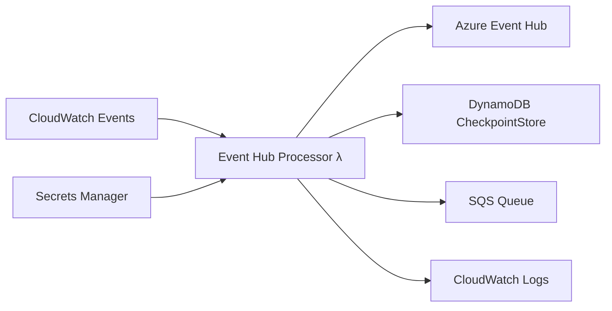

# Event Hub Processor Lambda

AWS Lambda function that connects to Azure Event Hub to consume Microsoft Defender for Cloud security events and forwards them to AWS SQS for CloudTrail transformation processing.

## Overview

This Lambda function implements a reliable event processor that:
- Polls Azure Event Hub on a scheduled basis (every 5 minutes)
- Maintains processing state using DynamoDB CheckpointStore for reliable resumption
- Forwards events to SQS queue for downstream CloudTrail transformation
- Provides comprehensive error handling and monitoring

## Architecture



## Configuration

### Environment Variables

| Variable | Required | Description |
|----------|----------|-------------|
| `AWS_REGION` | Yes | AWS region for services |
| `SQS_QUEUE_URL` | Yes | SQS queue URL for event forwarding |
| `AZURE_CREDENTIALS_SECRET_NAME` | Yes | Secrets Manager secret name for Azure credentials |
| `DYNAMODB_TABLE_NAME` | Yes | DynamoDB table name for checkpoint storage |
| `USE_CHECKPOINT_STORE` | No | Enable checkpoint store (default: 'true') |
| `LOGGING_LEVEL` | No | Logging level (default: 'INFO') |

### Azure Credentials Format

The Secrets Manager secret should contain Azure Event Hub credentials in this format:

```json
{
  "connectionString": "Endpoint=sb://namespace.servicebus.windows.net/;SharedAccessKeyName=keyname;SharedAccessKey=key;EntityPath=eventhub",
  "eventHubNamespace": "your-eventhub-namespace",
  "eventHubName": "your-eventhub-name",
  "consumerGroup": "$Default"
}
```

## Features

### Reliable Event Processing
- **Checkpoint Management**: DynamoDB-based checkpoint store maintains processing state
- **Resume from Last Position**: Automatically resumes from last processed event
- **Batch Processing**: Processes up to 100 events per execution
- **Connection Reuse**: Efficient connection pooling for improved performance

### Error Handling
- **Credential Validation**: Validates Azure credentials before processing
- **Connection Retry**: Handles temporary network issues
- **Graceful Degradation**: Falls back to cursor-based processing if needed
- **Comprehensive Logging**: Detailed logs for troubleshooting

### Monitoring Integration
- **CloudWatch Metrics**: Processing statistics and performance metrics
- **Structured Logging**: JSON-formatted logs with correlation IDs
- **Health Checks**: Environment validation on startup

## Processing Flow

1. **Scheduled Trigger**: CloudWatch Events triggers execution every 5 minutes
2. **Credential Retrieval**: Fetches Azure Event Hub credentials from Secrets Manager
3. **Checkpoint Recovery**: Loads last processed position from DynamoDB
4. **Event Consumption**: Connects to Azure Event Hub and polls for new events
5. **Event Processing**: Processes events and forwards to SQS queue
6. **Checkpoint Update**: Updates processing position in DynamoDB
7. **Statistics Reporting**: Reports processing statistics to CloudWatch

## Helper Modules

### SecretsManagerClient
```python
from helpers.secrets_manager_client import SecretsManagerClient

client = SecretsManagerClient(region='ca-central-1')
credentials = client.get_azure_credentials('secret-name')
```

### EventHubClient
```python
from helpers.eventhub_client import EventHubClient

client = EventHubClient(
    connection_string=credentials['connectionString'],
    eventhub_name=credentials['eventHubName'],
    consumer_group=credentials.get('consumerGroup', '$Default'),
    checkpoint_store=checkpoint_store
)

events = client.receive_events(max_events=100, max_wait_time=60)
```

### DynamoDBCheckpointStore
```python
from helpers.dynamodb_checkpoint_store import DynamoDBCheckpointStore

checkpoint_store = DynamoDBCheckpointStore(
    table_name='checkpoint-table',
    region_name='ca-central-1'
)

# List existing checkpoints
checkpoints = checkpoint_store.list_checkpoints(
    fully_qualified_namespace='namespace.servicebus.windows.net',
    eventhub_name='eventhub-name',
    consumer_group='$Default'
)

# Update checkpoint
checkpoint_store.update_checkpoint({
    'fully_qualified_namespace': 'namespace.servicebus.windows.net',
    'eventhub_name': 'eventhub-name',
    'consumer_group': '$Default',
    'partition_id': '0',
    'sequence_number': 12345,
    'offset': '67890'
})
```

### SQSClient
```python
from helpers.sqs_client import SQSClient

sqs_client = SQSClient(region_name='ca-central-1')
batch_entries = sqs_client.create_batch_entries(events, 'batch-id')
result = sqs_client.send_message_batch(queue_url, batch_entries)
```

## Event Format

Events forwarded to SQS maintain the original Azure structure with added metadata:

```json
{
  "event_data": {
    // Original Microsoft Defender event data
    "alertId": "unique-alert-id",
    "severity": "High",
    "category": "SecurityAlert",
    // ... other event fields
  },
  "event_metadata": {
    "sequence_number": "123456",
    "offset": "67890",
    "enqueued_time": "2024-01-15T10:30:00.000Z",
    "partition_id": "0",
    "partition_key": null,
    "properties": {},
    "system_properties": {}
  },
  "processing_metadata": {
    "processed_timestamp": "2024-01-15T10:30:01.123Z",
    "processor_version": "4.0.0",
    "source": "azure-eventhub",
    "eventhub_name": "defender-events",
    "consumer_group": "$Default"
  }
}
```

## Local Testing

### Prerequisites
- Python 3.11+
- Azure Event Hub access
- AWS credentials configured

### Setup
```bash
# Install dependencies
pip install -r requirements.txt

# Set environment variables
export AWS_REGION=ca-central-1
export SQS_QUEUE_URL=https://sqs.ca-central-1.amazonaws.com/123456789012/test-queue
export AZURE_CREDENTIALS_SECRET_NAME=test-azure-credentials
export DYNAMODB_TABLE_NAME=test-checkpoint-table
export USE_CHECKPOINT_STORE=true
export LOGGING_LEVEL=DEBUG
```

### Run Locally
```bash
# Run the Lambda function locally
python app.py
```

### Testing Scripts
```bash
# Run unit tests
python test_lambda.py

# Run integration tests (requires Azure Event Hub)
python local_test.py
```

## Monitoring and Troubleshooting

### CloudWatch Logs
```bash
# View logs
aws logs tail "/aws/lambda/mdc-event-hub-processor-dev" --follow

# Filter for errors
aws logs filter-log-events \
  --log-group-name "/aws/lambda/mdc-event-hub-processor-dev" \
  --filter-pattern "ERROR"
```

### Key Metrics to Monitor
- **Events Received**: Number of events polled from Azure Event Hub
- **Events Processed**: Number of events successfully processed
- **Events Sent to SQS**: Number of events forwarded to SQS
- **Checkpoints Updated**: Number of successful checkpoint updates
- **Errors**: Processing errors and failures

### Common Issues

| Issue | Cause | Solution |
|-------|-------|----------|
| **Azure Connection Failed** | Invalid credentials | Verify Azure Event Hub credentials in Secrets Manager |
| **No Events Received** | Event Hub empty or network issue | Check Event Hub status and network connectivity |
| **Checkpoint Store Errors** | DynamoDB permissions | Verify Lambda IAM role has DynamoDB permissions |
| **SQS Send Failures** | Queue permissions or limits | Check SQS queue permissions and throttling |
| **Lambda Timeout** | Large batch processing | Reduce max_events or increase timeout |

### Debug Commands
```bash
# Test Azure credentials
aws secretsmanager get-secret-value --secret-id YOUR_SECRET_NAME

# Check DynamoDB table
aws dynamodb scan --table-name YOUR_TABLE_NAME

# Test SQS queue
aws sqs get-queue-attributes --queue-url YOUR_QUEUE_URL --attribute-names All

# Manual Lambda invocation
aws lambda invoke \
  --function-name mdc-event-hub-processor-dev \
  --payload '{}' \
  response.json
```

## Performance Tuning

### Lambda Configuration
- **Memory**: 512MB (sufficient for typical workloads)
- **Timeout**: 300 seconds (5 minutes)
- **Reserved Concurrency**: 1 (single processor instance)

### Event Hub Optimization
- **Max Events**: 100 events per execution (configurable)
- **Max Wait Time**: 5 seconds for polling
- **Partition Strategy**: Processes partition 0 by default

### Checkpoint Management
- **Update Frequency**: After each successful SQS batch
- **Partition Tracking**: Individual checkpoints per partition
- **TTL**: Automatic cleanup of old checkpoint records

## Version History

- **v4.0.0**: CheckpointStore integration with DynamoDB composite key design
- **v3.0.0**: Enhanced error handling and monitoring
- **v2.0.0**: SQS integration and batch processing
- **v1.0.0**: Initial Event Hub polling implementation

## Dependencies

### Python Packages
- `azure-eventhub>=5.11.0`: Azure Event Hub SDK
- `boto3>=1.26.0`: AWS SDK for Python
- `json`: JSON processing (built-in)
- `logging`: Logging utilities (built-in)
- `os`: Environment variables (built-in)
- `time`: Time utilities (built-in)
- `uuid`: UUID generation (built-in)
- `datetime`: Date/time handling (built-in)

### AWS Services
- **Secrets Manager**: Azure credential storage
- **DynamoDB**: Checkpoint state management
- **SQS**: Event queue for downstream processing
- **CloudWatch**: Logging and monitoring
- **Lambda**: Function execution environment

### Azure Services
- **Event Hub**: Source of Microsoft Defender events
- **Azure AD**: Authentication for Event Hub access