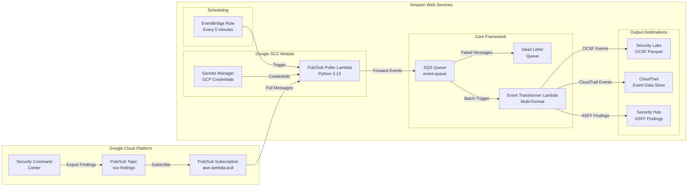
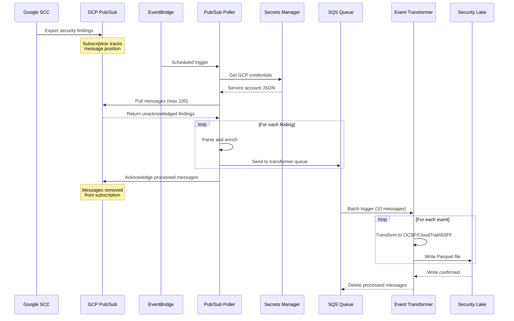

© 2025 Amazon Web Services, Inc. or its affiliates. All Rights Reserved.
This AWS Content is provided subject to the terms of the AWS Customer Agreement available at
http://aws.amazon.com/agreement or other written agreement between Customer and either
Amazon Web Services, Inc. or Amazon Web Services EMEA SARL or both.

# Google Security Command Center Integration Module

## Version 1.0.0

## Overview

The Google Security Command Center (SCC) integration module provides production-ready integration of Google Cloud security findings with AWS Security Lake. This module implements the Security Lake Integration Framework's [`IIntegrationModule`](../../docs/MODULE_INTERFACE_SPEC.md) interface, providing a pluggable, maintainable solution for cross-cloud security monitoring.

## Features

- **Google Pub/Sub Integration**: Scheduled polling of GCP Pub/Sub subscriptions for Security Command Center findings
- **AWS Secrets Manager Integration**: Secure storage of GCP service account credentials
- **Automatic Event Transformation**: Conversion to OCSF, CloudTrail, and ASFF formats via core event transformer
- **Comprehensive Monitoring**: CloudWatch metrics, alarms, and structured logging

## Architecture
### High-Level Architecture



### Data Flow Sequence




### Components

```
GCP Pub/Sub → [Pub/Sub Poller] → SQS Queue → Event Transformer → Security Lake
                                                                                        → CloudTrail
                                                                                        → Security Hub
```

### Key Resources

1. **Pub/Sub Poller Lambda** (Google SCC Module)
   - Scheduled execution (default: every 5 minutes)
   - Pulls messages from GCP Pub/Sub subscription
   - Single concurrent execution prevents duplicate processing

2. **AWS Secrets Manager Secret** (Google SCC Module)
   - GCP credentials: Service account JSON and project details

## Prerequisites

### Google Cloud Requirements

1. **GCP Project** with Security Command Center enabled
2. **Pub/Sub Topic and Subscription** configured for SCC findings
3. **Service Account** with appropriate permissions:
   - Pub/Sub Subscriber role
   - Security Center Findings Viewer role (if querying directly)

### AWS Requirements

1. **Security Lake enabled** in target AWS account/region
2. **Pre-existing Security Lake S3 bucket**
3. **Lake Formation** admin role configured
4. **IAM permissions** to deploy CDK stacks

## Configuration

### Module Configuration Structure

```yaml
integrations:
  google-scc:
    enabled: true
    modulePath: modules/google-scc  # Optional, defaults to modules/google-scc
    config:
      # Pub/Sub Poller Configuration
      pubsubPoller:
        enabled: true
        functionName: google-scc-pubsub-poller
        memorySize: 512
        timeout: 300
        reservedConcurrentExecutions: 1
        schedule: rate(5 minutes)
        environment:
          LOGGING_LEVEL: INFO
      
      # GCP Credentials Secret Name
      gcpCredentialsSecretName: gcp-pubsub-credentials
      
      # Secrets Manager Configuration
      secretsManager:
        gcpCredentialsSecret:
          secretName: gcp-pubsub-credentials
          description: GCP Pub/Sub credentials for Security Command Center integration
          create: true
          secretTemplate:
            projectId: PLACEHOLDER
            subscriptionId: PLACEHOLDER
            credentials: {}
      
      
```

### Configuration Parameters

#### Pub/Sub Poller

| Parameter | Type | Default | Description |
|-----------|------|---------|-------------|
| `enabled` | boolean | false | Enable/disable Pub/Sub poller |
| `functionName` | string | google-scc-pubsub-poller | Lambda function name |
| `memorySize` | number | 512 | Lambda memory in MB (128-10240) |
| `timeout` | number | 300 | Lambda timeout in seconds (1-900) |
| `reservedConcurrentExecutions` | number | 1 | Reserved concurrent executions (prevents duplicates) |
| `schedule` | string | rate(5 minutes) | EventBridge schedule expression |
| `environment` | object | {} | Additional environment variables |

## Installation

### Step 1: Set Up GCP Pub/Sub

Configure Pub/Sub for Security Command Center findings using Terraform or manually:

```bash
# Using Terraform (recommended)
cd integrations/google_security_command_center/terraform

cp terraform.tfvars.example terraform.tfvars
# Edit terraform.tfvars with your GCP project details

terraform init
terraform plan
terraform apply

# Note the outputs for AWS configuration
terraform output
```

### Step 2: Configure AWS CDK

Create or update `config.yaml`:

```bash
cd integrations/security-lake/cdk

cp config.example.yaml config.yaml

# Edit config.yaml and configure the Google SCC module
# Set integrations.google-scc.enabled: true
# Configure Pub/Sub poller settings
```

### Step 3: Deploy AWS Infrastructure

```bash
# Install dependencies
npm install

# Build TypeScript
npm run build

# Synthesize CloudFormation template
cdk synth -c configFile=config.yaml

# Deploy to AWS
cdk deploy -c configFile=config.yaml
```

### Step 4: Configure GCP Credentials

After deployment, configure the GCP service account credentials in AWS Secrets Manager:

```bash
cd integrations/google_security_command_center/scripts

# Run automated configuration script
./configure-secrets-manager.sh

# Or manually update secrets
aws secretsmanager update-secret \
  --secret-id gcp-pubsub-credentials \
  --secret-string '{
    "projectId": "your-gcp-project-id",
    "subscriptionId": "your-subscription-id",
    "credentials": {
      "type": "service_account",
      "project_id": "your-project-id",
      "private_key_id": "key-id",
      "private_key": "-----Your Private Key-----\n...",
      "client_email": "service-account@project.iam.gserviceaccount.com",
      "client_id": "123456789",
      "auth_uri": "https://accounts.google.com/o/oauth2/auth",
      "token_uri": "https://oauth2.googleapis.com/token",
      "auth_provider_x509_cert_url": "https://www.googleapis.com/oauth2/v1/certs",
      "client_x509_cert_url": "https://www.googleapis.com/robot/v1/metadata/x509/...",
      "gcp_subscription_id": "your-subscription-id"
    }
  }'
```

### Step 5: Verify Integration

Monitor Lambda execution and event flow:

```bash
# Check Pub/Sub Poller logs
aws logs tail /aws/lambda/google-scc-pubsub-poller --follow

# Check transformer queue depth
aws sqs get-queue-attributes \
  --queue-url $(aws sqs get-queue-url --queue-name event-queue --query QueueUrl --output text) \
  --attribute-names ApproximateNumberOfMessages

# Query Security Lake for Google SCC events
aws s3 ls s3://aws-security-data-lake-{region}-{hash}/ext/
```

## Lambda Functions

### Pub/Sub Poller

**Purpose**: Polls GCP Pub/Sub subscription on a schedule and forwards findings to transformer queue.

**Key Features**:
- GCP Pub/Sub SDK for reliable message consumption
- Native Pub/Sub acknowledgment system (no external checkpoint needed)
- Automatic connection reuse (prevents cold starts)
- Single concurrent execution
- Exponential backoff for transient failures

**Environment Variables**:
- `MODULE_ID`: google-scc
- `SQS_QUEUE_URL`: Event transformer queue URL
- `GCP_CREDENTIALS_SECRET_NAME`: Secrets Manager secret name
- `LOGGING_LEVEL`: INFO (default) or DEBUG

**Local Testing**:
```bash
cd modules/google-scc/src/lambda/pubsub-poller
python local_test.py
```

## IAM Permissions

The module requires the following IAM permissions:

```typescript
// Pub/Sub Poller Permissions
{
  "Effect": "Allow",
  "Action": [
    "secretsmanager:GetSecretValue",
    "secretsmanager:DescribeSecret"
  ],
  "Resource": "arn:aws:secretsmanager:{region}:{account}:secret:google-scc-*"
}
{
  "Effect": "Allow",
  "Action": "sqs:SendMessage",
  "Resource": "arn:aws:sqs:{region}:{account}:event-queue-*"
}
```

## Monitoring and Troubleshooting

### CloudWatch Metrics

Key metrics to monitor:

- `Invocations`: Lambda function invocations
- `Duration`: Lambda execution time
- `Errors`: Lambda execution errors
- `Throttles`: Lambda throttling events
- `ConcurrentExecutions`: Active Lambda executions

### CloudWatch Logs

Log groups:
- `/aws/lambda/google-scc-pubsub-poller`

### Common Issues

#### Issue: No messages received from Pub/Sub

**Symptoms**: Pub/Sub Poller runs successfully but processes zero messages

**Solutions**:
1. Verify Pub/Sub subscription has data: Check GCP Console metrics
2. Verify service account credentials: Test in GCP Console
3. Check subscription ID in secret: Ensure `gcp_subscription_id` field is correct
4. Verify IAM permissions: Check service account has Pub/Sub Subscriber role

#### Issue: Secrets Manager access denied

**Symptoms**: `AccessDeniedException` when accessing secrets

**Solutions**:
1. Verify IAM role permissions: Check Lambda execution role
2. Verify secret ARN: Ensure exact match in policy
3. Check KMS key permissions: If using customer-managed CMK

### Debug Mode

Enable detailed logging:

```yaml
integrations:
  google-scc:
    config:
      pubsubPoller:
        environment:
          LOGGING_LEVEL: DEBUG
```

## Performance Tuning

### Pub/Sub Poller

**High Volume Environments** (>1000 findings/minute):
```yaml
pubsubPoller:
  memorySize: 1024
  timeout: 600
  schedule: rate(1 minute)
```

**Low Volume Environments** (<100 findings/minute):
```yaml
pubsubPoller:
  memorySize: 256
  timeout: 120
  schedule: rate(15 minutes)
```

## Security Best Practices

1. **Rotate GCP credentials regularly**: Update Secrets Manager every 90 days
2. **Use least privilege IAM roles**: Only grant required permissions
3. **Enable encryption at rest**: Use customer-managed KMS keys in production
4. **Monitor failed authentication**: Set CloudWatch alarms for access denied errors
5. **Implement network isolation**: Use VPC endpoints for AWS service access
6. **Enable CloudTrail logging**: Audit all Secrets Manager access

## Cost Optimization

### Development Environment
- Use AWS_MANAGED encryption
- Disable CloudWatch alarms
- Reduce polling frequency
- Lower Lambda memory allocation

### Production Environment
- Use reserved concurrency carefully
- Monitor and optimize Lambda execution time
- Optimize polling frequency based on volume

**Estimated Monthly Costs** (1000 findings/hour):
- Lambda executions: $15-30
- Secrets Manager: $0.80
- CloudWatch Logs: $5-10
- Total: Approximately $25-45/month

## Version History

### Version 1.0.0 (2025-01-24)
- Initial modular Google SCC integration
- Pub/Sub poller with native message tracking
- Full integration with Security Lake framework
- Comprehensive monitoring and alerting

## References

**Framework Documentation:**
- [Security Lake Integration Framework](../../README.md) - Core framework and architecture
- [Module Interface Specification](../../docs/MODULE_INTERFACE_SPEC.md) - Module standards and contracts
- [Module Development Guide](../../docs/MODULE_DEVELOPMENT_GUIDE.md) - Creating custom modules
- [Configuration Schema](../../docs/CONFIG_SCHEMA.md) - Configuration options and validation
- [Installation Guide](../../../INSTALLATION_GUIDE.md) - Complete framework installation

**Related Integrations:**
- [Azure Module](../azure/README.md) - Microsoft Defender for Cloud integration
- [Google SCC Main README](../../../../google_security_command_center/README.md) - GCP SCC standalone integration
- [Google SCC Terraform](../../../../google_security_command_center/terraform/README.md) - GCP infrastructure deployment
- [Google SCC Scripts](../../../../google_security_command_center/scripts/README.md) - Configuration automation

**Lambda Function Documentation:**
- [Pub/Sub Poller Source Code](src/lambda/pubsub-poller/app.py) - Implementation details
- [Event Transformer](../../src/lambda/event-transformer/README.md) - Multi-format transformation
  - [Event Transformer Changelog](../../src/lambda/event-transformer/CHANGELOG.md)
  - [Debugging Failed Events](../../src/lambda/event-transformer/DEBUGGING_FAILED_EVENTS.md)
  - [DLQ Processing Guide](../../src/lambda/event-transformer/dlq_processing_guide.md)

**External Resources:**
- [Google Security Command Center Documentation](https://cloud.google.com/security-command-center/docs)
- [Google Pub/Sub Documentation](https://cloud.google.com/pubsub/docs)
- [AWS Security Lake Documentation](https://docs.aws.amazon.com/security-lake/)
- [OCSF Schema](https://schema.ocsf.io/)

## Support

For questions or issues with this module:
1. Review this documentation and troubleshooting section
2. Check CloudWatch Logs for detailed error messages
3. Consult the Module Development Guide
4. Contact your AWS Professional Services team