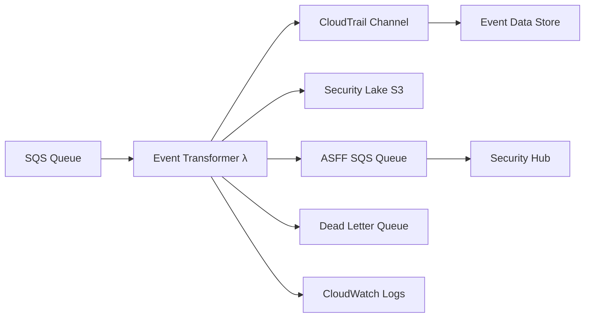

# Event Transformer Lambda

AWS Lambda function that converts cloud security events from SQS queue to multiple target formats (CloudTrail, OCSF, ASFF) and delivers them to AWS security services for unified cross-cloud security monitoring.

## Overview

This Lambda function implements a comprehensive multi-format event transformation pipeline that:
- Receives cloud security events (Azure, GCP, etc.) from SQS queue (standard trigger)
- Transforms events to multiple target formats:
  - **CloudTrail format** for CloudTrail Lake Event Data Store
  - **OCSF format** for AWS Security Lake (Parquet files in S3)
  - **ASFF format** for AWS Security Hub (via SQS queue)
- Delivers transformed events to appropriate AWS security services
- Supports custom queue processing for DLQ and batch operations
- Provides robust error handling with partial batch failure support

## Architecture



## Configuration

### Environment Variables

| Variable | Required | Description |
|----------|----------|-------------|
| `EVENT_DATA_STORE_ARN` | Yes | CloudTrail Event Data Store ARN |
| `CLOUDTRAIL_CHANNEL_ARN` | Yes | CloudTrail Channel ARN for external event ingestion |
| `CLOUDTRAIL_ENABLED` | No | Enable CloudTrail integration (default: 'true') |
| `SECURITY_LAKE_ENABLED` | No | Enable Security Lake OCSF integration (default: 'false') |
| `SECURITY_LAKE_S3_BUCKET` | No | Security Lake S3 bucket name (required if Security Lake enabled) |
| `SECURITY_LAKE_SOURCES` | No | JSON configuration for Security Lake sources |
| `SECURITY_LAKE_PATH` | No | Custom path prefix for Security Lake data |
| `EVENT_DLQ` | No | Dead Letter Queue URL for failed transformations |
| `LOGGING_LEVEL` | No | Logging level: INFO (default), DEBUG, WARN, ERROR |
| `ASFF_ENABLED` | No | Enable ASFF transformation for AWS Security Hub (default: 'false') |
| `ASFF_SQS_QUEUE` | No | SQS Queue URL for ASFF findings (required if ASFF_ENABLED=true) |
| `AWS_REGION` | No | AWS region for ProductArn generation (auto-detected from Lambda environment) |
| `VALIDATE_OCSF` | No | Enable OCSF event validation (default: 'false') |

### CloudTrail Integration

The function requires:
- **Event Data Store**: Must support external event ingestion
- **Channel**: CloudTrail Channel configured for the Event Data Store
- **Permissions**: Lambda must have `cloudtrail-data:PutAuditEvents` permission

## Features

### Dual Processing Modes
- **SQS Trigger Events**: Standard Lambda SQS integration with automatic scaling
- **Custom Queue Processing**: Manual queue processing with configurable batch sizes
- **Batch Item Failures**: Returns failed message IDs for SQS retry mechanism
- **Immediate Message Deletion**: Messages deleted immediately after successful processing (custom queues)
- **Smart Queue Polling**: Only processes messages that actually exist in queue

### Multi-Format Transformation

The transformer supports three output formats, each optimized for different AWS security services:

#### CloudTrail Format
- **Target**: CloudTrail Lake Event Data Store
- **Use Case**: Unified audit logging across cloud providers
- **Format**: CloudTrail-compatible JSON events
- **Delivery**: Via CloudTrail Channel using `PutAuditEvents` API
- **Features**:
  - Identity transformation (maps cloud identities to CloudTrail userIdentity)
  - Resource mapping (converts cloud resources to CloudTrail resource format)
  - Metadata preservation (maintains original event data in additionalEventData)

#### OCSF Format
- **Target**: AWS Security Lake
- **Use Case**: Security data lake with standardized schema
- **Format**: OCSF v1.0.0 events in Parquet files
- **Delivery**: Direct upload to Security Lake S3 bucket with partitioning
- **Features**:
  - Template-driven transformation using YAML templates
  - PyArrow-based Parquet generation for optimal performance
  - Automatic partitioning by region, account ID, and event day

#### ASFF Format
- **Target**: AWS Security Hub
- **Use Case**: Centralized security findings and compliance management
- **Format**: AWS Security Finding Format (ASFF) v2018-10-08 JSON
- **Delivery**: Via SQS queue for batch import to Security Hub
- **Features**:
  - Finding classification (detection, compliance, vulnerability findings)
  - Compliance tracking (status, standards, control mapping)
  - Severity normalization (Label + Normalized 0-100 scale)
  - MITRE ATT&CK mapping for security alerts

### Robust Error Handling
- **Partial Batch Failures**: Individual message retry for failed transformations
- **Dead Letter Queue**: Failed messages sent to DLQ for investigation with cycle prevention
- **DLQ Cycle Prevention**: Prevents infinite loops when processing DLQ messages
- **Comprehensive Logging**: Detailed error tracking with full stack traces
- **Graceful Degradation**: Continues processing valid events despite individual failures
- **Variable Name Isolation**: Prevents event type conflicts during processing

### Enhanced Monitoring and Logging
- **Processing Statistics**: Detailed metrics for transformation success/failure rates
- **Performance Tracking**: Execution time and throughput monitoring
- **Structured Logging**: INFO level for deletions, WARN level for DLQ sends
- **Third-Party Log Suppression**: PyArrow, boto3, botocore debug logs suppressed
- **Diagnostic Logging**: Enhanced debugging capabilities (enable with LOGGING_LEVEL=DEBUG)
- **Message Lifecycle Tracking**: Complete visibility from fetch to deletion

## Processing Flow

### SQS Trigger Events (Standard)
1. **SQS Integration**: Lambda triggered by SQS messages (up to 10 per batch)
2. **Event Extraction**: Parses cloud security events from SQS message bodies
3. **Transformation**: Converts events to configured output format(s):
   - CloudTrail format (if `CLOUDTRAIL_ENABLED=true`)
   - OCSF format (if `SECURITY_LAKE_ENABLED=true`)
   - ASFF format (if `ASFF_ENABLED=true`)
4. **Delivery**: Sends events to appropriate destination(s):
   - CloudTrail Channel → Event Data Store
   - Security Lake S3 bucket (Parquet files)
   - ASFF SQS queue → Security Hub
5. **Batch Results**: Returns failed message IDs for retry

### Custom Queue Processing (Enhanced)
1. **Manual Invocation**: Lambda invoked with `queue_url` parameter
2. **Smart Polling**: Fetches only actual messages from queue (stops when empty)
3. **Processing**: Transforms and delivers events to all enabled destinations:
   - CloudTrail Event Data Store (if enabled)
   - Security Lake S3 (if enabled)
   - Security Hub via ASFF queue (if enabled)
4. **Immediate Deletion**: Messages deleted immediately after successful processing
5. **Cycle Prevention**: Prevents sending failed DLQ messages back to same DLQ
6. **Statistics**: Returns comprehensive processing and deletion statistics for all formats

## Event Transformation

### Input Format (Cloud Security Event)
```json
{
  "event_data": {
    "alertId": "unique-alert-id",
    "severity": "High",
    "category": "SecurityAlert",
    "resourceId": "/subscriptions/sub-id/resourceGroups/rg/providers/...",
    "subscriptionId": "cloud-provider-subscription-id",
    // ... other cloud provider fields
  },
  "event_metadata": {
    "sequence_number": "123456",
    "offset": "67890",
    "enqueued_time": "2024-01-15T10:30:00.000Z",
    "partition_id": "0"
  },
  "processing_metadata": {
    "processed_timestamp": "2024-01-15T10:30:01.123Z",
    "processor_version": "4.0.0",
    "source": "azure-eventhub"
  }
}
```

### Output Format (CloudTrail Event)
```json
{
  "eventVersion": "1.05",
  "userIdentity": {
    "type": "AzureAD",
    "principalId": "azure-resource-id",
    "accountId": "azure-subscription-id"
  },
  "eventTime": "2024-01-15T10:30:00Z",
  "eventSource": "cloud-security-service",
  "eventName": "SecurityAlert",
  "awsRegion": "ca-central-1",
  "sourceIPAddress": "cloud-resource-location",
  "userAgent": "Cloud-Security-CloudTrail-Integration/3.1.0",
  "resources": [
    {
      "accountId": "azure-subscription-id",
      "type": "azure-resource",
      "ARN": "azure-resource-id"
    }
  ],
  "responseElements": null,
  "additionalEventData": {
    "severity": "High",
    "category": "SecurityAlert",
    "azure_metadata": {
      "sequence_number": "123456",
      "partition_id": "0",
      "enqueued_time": "2024-01-15T10:30:00.000Z"
    },
    "original_azure_event": { /* Complete original event */ }
  }

### ASFF Format Output (AWS Security Hub)

The transformer supports AWS Security Finding Format (ASFF) v2018-10-08 for direct integration with AWS Security Hub.

#### Output Format (ASFF Finding)
```json
{
  "SchemaVersion": "2018-10-08",
  "Id": "azure-alert-id-or-uuid",
  "ProductArn": "arn:aws:securityhub:us-east-1:123456789012:product/123456789012/default",
  "ProductName": "Microsoft Defender for Cloud",
  "CompanyName": "Microsoft",
  "GeneratorId": "azure-defender-alert-type",
  "AwsAccountId": "123456789012",
  "Types": ["TTPs/Defense Evasion"],
  "CreatedAt": "2024-01-15T10:30:00Z",
  "UpdatedAt": "2024-01-15T10:30:00Z",
  "Severity": {
    "Label": "HIGH",
    "Normalized": 80
  },
  "Title": "Azure Security Alert Title",
  "Description": "Detailed description of the security finding",
  "Remediation": {
    "Recommendation": {
      "Text": "Steps to remediate the finding",
      "Url": "https://portal.azure.com/..."
    }
  },
  "ProductFields": {
    "azure/alertType": "VM_SuspiciousActivity",
    "azure/subscriptionId": "azure-subscription-id",
    "aws/securityhub/ProductName": "Microsoft Defender for Cloud"
  },
  "Resources": [{
    "Type": "Other",
    "Id": "azure-resource-id",
    "Partition": "azure",
    "Region": "eastus"
  }],
  "WorkflowState": "NEW",
  "RecordState": "ACTIVE"
}
```

#### ASFF Event Type Mappings

| Cloud Event Type | ASFF Finding Type | Description |
|------------------|-------------------|-------------|
| `security_alert` | Detection Finding | Cloud security alerts with MITRE ATT&CK mapping |
| `secure_score` | Compliance Finding | Security score assessments with compliance status |
| `security_assessment` | Vulnerability Finding | Security posture assessments with remediation guidance |
| `compliance_assessment` | Compliance Finding | Regulatory compliance assessments (NIST, SOC, PCI, etc.) |

#### ASFF Severity Mapping

| Azure Severity | ASFF Label | ASFF Normalized |
|----------------|------------|-----------------|
| Informational | INFORMATIONAL | 0 |
| Low | LOW | 30 |
| Medium | MEDIUM | 60 |
| High | HIGH | 80 |
| Critical | CRITICAL | 100 |

#### Usage with ASFF Format

```python
from core.event_mapper import CloudEventMapper

# Initialize mapper
mapper = CloudEventMapper(logger=logger, use_templates=True)

# Transform to ASFF format
asff_finding = mapper.map_cloud_event_to_cloudtrail(
    cloud_event,
    aws_account_id='123456789012',
    output_format='asff'
)

# Send to Security Hub (example)
import boto3
securityhub = boto3.client('securityhub')
response = securityhub.batch_import_findings(
    Findings=[asff_finding]

## ASFF Format Support

### Overview

The Event Transformer now supports AWS Security Finding Format (ASFF) v2018-10-08, enabling direct integration with AWS Security Hub for centralized security findings management across Azure and AWS environments.

### ASFF Features

- **Schema Compliance**: Fully compliant with ASFF v2018-10-08 specification
- **Finding Classification**: Automatically maps cloud security events to appropriate ASFF finding types
- **Severity Normalization**: Converts cloud provider severity to ASFF Label + Normalized (0-100) format
- **Compliance Tracking**: Maps cloud compliance assessments to ASFF Compliance object
- **Remediation Guidance**: Preserves cloud provider remediation steps in ASFF Remediation object
- **Resource Mapping**: Converts cloud resources to ASFF Resources array
- **MITRE ATT&CK**: Maps cloud security tactics to ASFF Types taxonomy

### ASFF Templates

Four ASFF templates are available for different cloud event types:

#### 1. Security Alert → Detection Finding
**Template**: `security_alert_asff.yaml`

Maps cloud security alerts to ASFF detection findings with:
- MITRE ATT&CK tactic mapping (TTPs namespace)
- Threat intelligence from cloud provider entities
- Source IP and compromised entity tracking
- Full remediation steps preservation

**Example Finding Types**:
- `TTPs/Defense Evasion`
- `TTPs/Credential Access`
- `Effects/Data Exfiltration`

#### 2. Secure Score → Compliance Finding
**Template**: `secure_score_asff.yaml`

Maps cloud security score to ASFF compliance findings with:
- Score-based compliance status (PASSED/WARNING/FAILED)
- Inverted severity (lower score = higher severity)
- Current/max score tracking in ProductFields
- Compliance status reasons with percentage

#### 3. Security Assessment → Vulnerability Finding
**Template**: `security_assessment_asff.yaml`

Maps cloud security assessments to ASFF vulnerability findings with:
- CVE tracking support
- Resource-level vulnerability identification
- Health status to RecordState mapping (Healthy → ARCHIVED)
- Assessment category and type preservation

#### 4. Compliance Assessment → Compliance Finding
**Template**: `compliance_assessment_asff.yaml`

Maps cloud compliance assessments to ASFF compliance findings with:
- Multi-standard support (NIST, SOC, PCI, ISO, etc.)
- Control-level compliance tracking
- Associated standards and requirements
- Regulatory compliance status mapping

### Configuration

Enable ASFF transformation by setting environment variables:
```bash
export ASFF_ENABLED=true
export ASFF_SQS_QUEUE=https://sqs.us-east-1.amazonaws.com/123456789012/asff-findings-queue
export AWS_REGION=us-east-1  # For ProductArn generation
```

**Required Configuration:**
- `ASFF_ENABLED=true` - Enables ASFF transformation
- `ASFF_SQS_QUEUE` - SQS Queue URL where ASFF findings will be sent
- `AWS_REGION` - AWS region (auto-detected from Lambda environment if not set)

**Architecture:**
```
Cloud Events → Event Transformer → ASFF Findings → SQS Queue → [Your Consumer]
                                                                    ↓
                                                          AWS Security Hub
                                                          (BatchImportFindings)
```

The Lambda transforms cloud security events to ASFF format and sends them to an SQS queue. A separate consumer (Lambda, Step Function, etc.) can then:
1. Receive ASFF findings from the queue
2. Batch them (up to 100 per call)
3. Import to AWS Security Hub using `BatchImportFindings` API

Add ASFF-specific fields to `event_type_mappings.json`:
```json
{
  "security_alert": {
    "asff_product_name": "Microsoft Defender for Cloud",
    "asff_product_id": "azure-defender"
  }
}
```

### Usage Examples

#### Transform Single Event to ASFF
```python
from core.event_mapper import CloudEventMapper

mapper = CloudEventMapper(logger=logger, use_templates=True)

# Transform cloud security alert to ASFF
asff_finding = mapper.map_cloud_event_to_cloudtrail(
    cloud_event=cloud_security_alert,
    aws_account_id='123456789012',
    output_format='asff'
)

# Result is a dictionary compliant with ASFF v2018-10-08
print(json.dumps(asff_finding, indent=2))
```

#### Send to AWS Security Hub
```python
import boto3

securityhub = boto3.client('securityhub', region_name='us-east-1')

# Batch import findings to Security Hub
response = securityhub.batch_import_findings(
    Findings=[asff_finding]
)

print(f"Imported {response['SuccessCount']} findings")
if response['FailedFindings']:
    print(f"Failed: {response['FailedFindings']}")
```

#### Process Multiple Events
```python
from core.event_mapper import CloudEventMapper

mapper = CloudEventMapper(logger=logger, use_templates=True)

asff_findings = []
for cloud_event in cloud_events:
    finding = mapper.map_cloud_event_to_cloudtrail(
        cloud_event,
        aws_account_id='123456789012',
        output_format='asff'
    )
    if finding:
        asff_findings.append(finding)

# Batch import to Security Hub (max 100 per call)
for i in range(0, len(asff_findings), 100):
    batch = asff_findings[i:i+100]
    securityhub.batch_import_findings(Findings=batch)

#### Automatic ASFF Processing (Production Mode)

When `ASFF_ENABLED=true` and `ASFF_SQS_QUEUE` is configured, the Lambda automatically:
1. Transforms all cloud security events to ASFF format
2. Sends findings to the configured SQS queue
3. Tracks statistics for monitoring

**Consumer Lambda Example (SQS Queue → Security Hub):**
```python
import json
import boto3

def handler(event, context):
    """Consumer Lambda to import ASFF findings from SQS to Security Hub"""
    securityhub = boto3.client('securityhub')
    
    findings = []
    for record in event['Records']:
        finding = json.loads(record['body'])
        findings.append(finding)
    
    # Import to Security Hub (max 100 per call)
    for i in range(0, len(findings), 100):
        batch = findings[i:i+100]
        response = securityhub.batch_import_findings(Findings=batch)
        print(f"Imported {response['SuccessCount']} findings")
        
        if response.get('FailedFindings'):
            for failed in response['FailedFindings']:
                print(f"Failed: {failed}")
    
    return {'statusCode': 200, 'findingsProcessed': len(findings)}
```

**Monitoring ASFF Processing:**
```python
# Check Lambda CloudWatch logs for ASFF statistics
# Example log output:
{
  "asff_enabled": true,
  "asff_findings_sent": 25,
  "asff_send_failures": 0,
  "total_cloud_events": 25
}
```
```

### ASFF Field Mappings

#### Required ASFF Fields

| ASFF Field | Cloud Source | Description |
|------------|--------------|-------------|
| `SchemaVersion` | Fixed | "2018-10-08" |
| `Id` | SystemAlertId / event ID | Unique finding identifier |
| `ProductArn` | Generated | ARN format with account and product IDs |
| `GeneratorId` | Alert/Assessment type | Solution-specific component ID |
| `AwsAccountId` | Context | AWS account receiving the finding |
| `Types` | Alert type | ASFF Types taxonomy (TTPs/Effects/Software Checks) |
| `CreatedAt` | TimeGenerated | ISO 8601 timestamp |
| `UpdatedAt` | ProcessingEndTime | ISO 8601 timestamp |
| `Severity` | Cloud Provider Severity | Label + Normalized (0-100) |
| `Title` | DisplayName | Finding title |
| `Description` | Description | Detailed description (truncated to 1024 chars) |
| `Resources` | ResourceId | Array of affected resources |

#### Optional ASFF Fields

| ASFF Field | Cloud Source | Notes |
|------------|--------------|-------|
| `Compliance` | Assessment status | Status, RelatedRequirements, SecurityControlId |
| `Remediation` | RemediationSteps | Text + URL format |
| `ProductFields` | Extended Properties | Cloud provider-specific metadata |
| `WorkflowState` | Fixed | Always "NEW" for incoming findings |
| `RecordState` | Status | ACTIVE for unhealthy, ARCHIVED for passed/healthy |

### ASFF Compliance Status Mapping

Cloud provider compliance states map to ASFF as follows:

| Cloud Provider State | ASFF Compliance Status | ASFF RecordState |
|---------------------|----------------------|------------------|
| PASSED | PASSED | ARCHIVED |
| FAILED | FAILED | ACTIVE |
| NOT_APPLICABLE | NOT_APPLICABLE | ARCHIVED |

### Severity Calculation

**For Security Alerts:**
Direct mapping from cloud provider severity to ASFF

**For Secure Score:**
Inverted calculation where lower score = higher severity
- Score ≥90%: INFORMATIONAL (0)
- Score 70-89%: LOW (30)  
- Score 50-69%: MEDIUM (60)
- Score <50%: HIGH/CRITICAL (80-100)

### Troubleshooting ASFF

#### Common Issues

| Issue | Cause | Solution |
|-------|-------|----------|
| **Missing ProductArn** | AWS_REGION not set | Set AWS_REGION environment variable |
| **Invalid ASFF Schema** | Template syntax error | Check template YAML syntax |
| **Security Hub Import Failure** | Schema validation error | Verify all required ASFF fields present |
| **Missing Filters** | Template uses undefined filter | Check filter registration in template_transformer.py |

#### Debug ASFF Transformation
```bash
# Enable debug logging
export LOGGING_LEVEL=DEBUG

# Test ASFF transformation locally
python -c "
from core.template_transformer import TemplateTransformer
from core.event_mapper import CloudEventMapper
import json

mapper = CloudEventMapper(use_templates=True)
result = mapper.map_azure_event_to_cloudtrail(
    azure_event=test_event,
    aws_account_id='123456789012',
    output_format='asff'
)
print(json.dumps(result, indent=2))
"
```

### ASFF Template Structure

Each ASFF template follows this structure:
```yaml
name: "event_type_to_asff"
input_schema: "azure_event_schema"
output_schema: "asff_finding"

extractors:
  # JSONPath expressions to extract Azure fields
  field_name: "$.event_data.AzureField"

template: |
  {
    "SchemaVersion": "2018-10-08",
    "Id": "{{ extractors.field_name }}",
    # ... ASFF fields
  }

filters:
  # Custom Jinja2 filters for this template
  custom_filter: |
    def custom_filter(value):
      return transformed_value
```

### Security Hub Integration

#### Prerequisites
- AWS Security Hub enabled in target region
- IAM permissions for `securityhub:BatchImportFindings`
- Product subscription created (automatic on first import)

#### Best Practices
- Batch findings (up to 100 per API call)
- Handle `FailedFindings` in response
- Monitor Security Hub quotas
- Use meaningful ProductArn with account ID
- Include remediation guidance when available

)
```

#### ASFF Template Files

ASFF templates are located in `templates/` directory:
- [`security_alert_asff.yaml`](templates/security_alert_asff.yaml) - Detection findings
- [`secure_score_asff.yaml`](templates/secure_score_asff.yaml) - Secure Score compliance
- [`security_assessment_asff.yaml`](templates/security_assessment_asff.yaml) - Vulnerability assessments
- [`compliance_assessment_asff.yaml`](templates/compliance_assessment_asff.yaml) - Compliance assessments

}
```

## Helper Modules

### CloudTrailTransformer
```python
from helpers.event_transformer import CloudTrailTransformer

transformer = CloudTrailTransformer(
    event_data_store_arn='arn:aws:cloudtrail:region:account:eventdatastore/id',
    channel_arn='arn:aws:cloudtrail:region:account:channel/id',
    logger=logger
)

# Transform events
cloudtrail_events = transformer.transform_events_batch(
    cloud_events,
    aws_account_id
)

# Send to Event Data Store
result = transformer.send_events_to_datastore(cloudtrail_events)
```

## Event Types

### Standard SQS Trigger Event
```json
{
  "Records": [
    {
      "messageId": "message-id",
      "receiptHandle": "receipt-handle",
      "body": "{\"event_data\": {...}}",
      "attributes": {},
      "messageAttributes": {},
      "eventSource": "aws:sqs"
    }
  ]
}
```

### Custom Queue Processing Event
```json
{
  "queue_url": "https://sqs.region.amazonaws.com/account/queue-name",
  "max_messages": 100
}
```

## Usage Examples

### Manual Testing
```bash
# Test with SQS trigger event
aws lambda invoke \
  --function-name mdc-event-transformer-dev \
  --payload file://test-sqs-event.json \
  response.json

# Test with custom queue processing
aws lambda invoke \
  --function-name mdc-event-transformer-dev \
  --payload '{"queue_url":"https://sqs.ca-central-1.amazonaws.com/123456789012/dlq","max_messages":10}' \
  response.json
```

### Integration Testing
```python
# Integration test example
import json
from app import lambda_handler

# Mock SQS event
event = {
    "Records": [{
        "messageId": "test-message",
        "body": json.dumps({
            "event_data": {
                "alertId": "test-alert",
                "severity": "High"
            }
        })
    }]
}

# Mock context
class MockContext:
    invoked_function_arn = "arn:aws:lambda:ca-central-1:123456789012:function:test"

result = lambda_handler(event, MockContext())
print(json.dumps(result, indent=2))
```

## Local Testing

### Prerequisites
- Python 3.11+
- CloudTrail Event Data Store and Channel configured
- AWS credentials with CloudTrail permissions

### Setup
```bash
# Install dependencies
pip install -r requirements.txt

# Set environment variables
export EVENT_DATA_STORE_ARN=arn:aws:cloudtrail:ca-central-1:123456789012:eventdatastore/your-id
export CLOUDTRAIL_CHANNEL_ARN=arn:aws:cloudtrail:ca-central-1:123456789012:channel/your-id
export LOGGING_LEVEL=DEBUG
```

### Testing Scripts
```bash
# Test transformation logic
python debug_transform.py

# Test failed event debugging
python debug_failed_events.py

# Integration test with real CloudTrail
python integration_test.py

# Custom queue processing test
python test_custom_queue_processing.py
```

## Monitoring and Troubleshooting

### CloudWatch Logs
```bash
# View logs
aws logs tail "/aws/lambda/mdc-event-transformer-dev" --follow

# Filter for errors
aws logs filter-log-events \
  --log-group-name "/aws/lambda/mdc-event-transformer-dev" \
  --filter-pattern "ERROR"

# Filter for transformation failures
aws logs filter-log-events \
  --log-group-name "/aws/lambda/mdc-event-transformer-dev" \
  --filter-pattern "Failed Azure events"
```

### Key Metrics to Monitor

| Metric | Description | Normal Range |
|--------|-------------|--------------|
| `total_messages` | Messages processed per execution | 1-10 (SQS trigger) |
| `successful_transformations` | Events successfully transformed | 80-100% |
| `failed_transformations` | Events that failed transformation | 0-20% |
| `events_sent_to_datastore` | Events delivered to CloudTrail | Match successful transformations |
| `datastore_send_failures` | CloudTrail delivery failures | 0-5% |

### Common Issues

| Issue | Cause | Solution |
|-------|-------|----------|
| **CloudTrail Channel Error** | Invalid Channel ARN | Verify Channel ARN and permissions |
| **Event Data Store Access Denied** | Missing permissions | Add `cloudtrail-data:PutAuditEvents` permission |
| **Transformation Failures** | Invalid Azure event format | Check event structure and mapping logic |
| **Partial Batch Failures** | Mixed success/failure in batch | Normal operation - failed items will retry |
| **DLQ Processing Issues** | Queue permissions or network | Verify SQS permissions and connectivity |

### Debug Commands
```bash
# Test CloudTrail Channel directly
aws cloudtrail-data put-audit-events \
  --channel-arn $CLOUDTRAIL_CHANNEL_ARN \
  --audit-events file://sample-event.json

# Check Event Data Store status
aws cloudtrail describe-event-data-store \
  --event-data-store $EVENT_DATA_STORE_ARN

# View DLQ messages
aws sqs receive-message \
  --queue-url $DLQ_URL \
  --max-number-of-messages 10

# Test custom queue processing
aws lambda invoke \
  --function-name mdc-event-transformer-dev \
  --payload '{"queue_url":"'$DLQ_URL'","max_messages":1}' \
  dlq-test-response.json
```

## Performance Tuning

### Lambda Configuration
- **Memory**: 512MB (sufficient for transformation workloads)
- **Timeout**: 60 seconds (per message processing)
- **Reserved Concurrency**: 10 (parallel processing)
- **Batch Size**: 10 messages (SQS trigger)
- **Max Batching Window**: 5 seconds

### CloudTrail Integration
- **Batch Size**: Up to 100 events per `PutAuditEvents` call
- **Event Size**: CloudTrail events limited to 256KB each
- **Rate Limits**: Consider CloudTrail API throttling limits

### Error Handling Optimization
- **Retry Strategy**: SQS handles retries for failed batch items
- **DLQ Processing**: Process DLQ messages separately to avoid blocking
- **Circuit Breaker**: Stop processing on repeated CloudTrail failures

## Testing Strategies

### Unit Testing
- **Transformation Logic**: Test Azure to CloudTrail mapping
- **Error Scenarios**: Test malformed event handling
- **Edge Cases**: Test empty batches, oversized events

### Integration Testing
- **End-to-End**: Azure Event Hub → SQS → CloudTrail
- **CloudTrail Validation**: Verify events appear in Event Data Store
- **Error Paths**: Test DLQ processing and retry scenarios

### Load Testing
- **Batch Processing**: Test with maximum batch sizes
- **Concurrent Execution**: Test with multiple Lambda instances
- **CloudTrail Limits**: Test with high-volume event delivery

## Recent Bug Fixes & Improvements

### JSON Parsing Error Resolution (2024-10)
- **Issue**: Template rendering failures due to double JSON escaping in `raw_data` fields
- **Root Cause**: Complex HTML content with URLs causing malformed JSON at character position 5394
- **Fix**: Removed redundant `| replace('\"', '\\\"')` from OCSF templates - `to_json` filter handles escaping
- **Impact**: Eliminated JSON parsing errors for all Azure event types

### Queue Message Deletion Logic Fix (2024-10)
- **Issue**: Successfully processed messages not being deleted from custom queues
- **Root Cause**: Variable name conflict where `event_type` was being overwritten during Azure event processing
- **Fix**: Renamed Azure event type variable to `azure_event_type` to prevent conflict
- **Impact**: Messages now properly deleted immediately after successful processing

### DLQ Cycle Prevention (2024-10)
- **Issue**: Failed DLQ messages being sent back to the same DLQ creating infinite loops
- **Fix**: Added source queue detection to prevent sending messages back to origin DLQ
- **Impact**: Eliminates infinite message cycling, improves DLQ processing reliability

## Related Documentation

**Framework and Modules:**
- [Security Lake Integration Framework](../../../README.md) - Core framework overview
- [Azure Module README](../../../modules/azure/README.md) - Microsoft Defender integration
- [Google SCC Module README](../../../modules/google-scc/README.md) - GCP SCC integration
- [Installation Guide](../../../../INSTALLATION_GUIDE.md) - Complete framework setup
- [Configuration Schema](../../../../docs/CONFIG_SCHEMA.md) - Configuration reference

**Other Lambda Functions:**
- [Flow Log Processor](../../flow-log-processor/README.md) - Network flow log processing
- [Security Hub Processor](../../securityhub-processor/app.py) - ASFF finding import

**Troubleshooting Guides:**
- [Debugging Failed Events](./DEBUGGING_FAILED_EVENTS.md) - Event transformation troubleshooting
- [DLQ Processing Guide](./dlq_processing_guide.md) - Failed event recovery
- [CHANGELOG](./CHANGELOG.md) - Recent updates and bug fixes

**External Resources:**
- [AWS Security Lake Documentation](https://docs.aws.amazon.com/security-lake/) - Security Lake and OCSF
- [CloudTrail Lake Documentation](https://docs.aws.amazon.com/awscloudtrail/latest/userguide/cloudtrail-lake.html) - Event Data Store
- [AWS Security Hub Documentation](https://docs.aws.amazon.com/securityhub/) - ASFF format
- [OCSF Schema](https://schema.ocsf.io/) - Open Cybersecurity Schema Framework

### Efficient Queue Processing (2024-10)
- **Issue**: Function processed phantom messages when requesting more than available
- **Fix**: Immediate break on empty queue (WaitTimeSeconds=0) instead of waiting for messages
- **Impact**: Only processes actual messages, improves performance and reduces costs

### Enhanced Logging and Monitoring (2024-10)
- **Third-Party Log Suppression**: PyArrow, boto3, botocore debug logs moved to DEBUG level
- **Structured Log Levels**: INFO for deletions, WARN for DLQ sends, DEBUG for diagnostics
- **Message Lifecycle Tracking**: Complete visibility from queue fetch to deletion
- **Diagnostic Capabilities**: Enhanced debugging for template rendering and message processing

## Version History

- **v3.1.1**: Bug fixes for JSON parsing, queue processing, and DLQ cycling (2024-10)
- **v3.1.0**: Enhanced with Custom Queue Processing and DLQ support
- **v3.0.0**: CloudTrail Channel integration with Event Data Store
- **v2.0.0**: Azure event transformation to CloudTrail format
- **v1.0.0**: Initial SQS message processing implementation

## Dependencies

### Python Packages
- `boto3>=1.26.0`: AWS SDK for CloudTrail and SQS operations
- `json`: JSON processing (built-in)
- `logging`: Logging utilities (built-in)
- `os`: Environment variables (built-in)

### AWS Services
- **CloudTrail**: Event Data Store and Channel for event ingestion
- **SQS**: Message queue for event processing
- **Lambda**: Function execution environment
- **CloudWatch**: Logging and monitoring

### CloudTrail Requirements
- **Event Data Store**: Must support external event ingestion
- **Channel**: Configured for the target Event Data Store
- **API Permissions**: `cloudtrail-data:PutAuditEvents` and Channel access